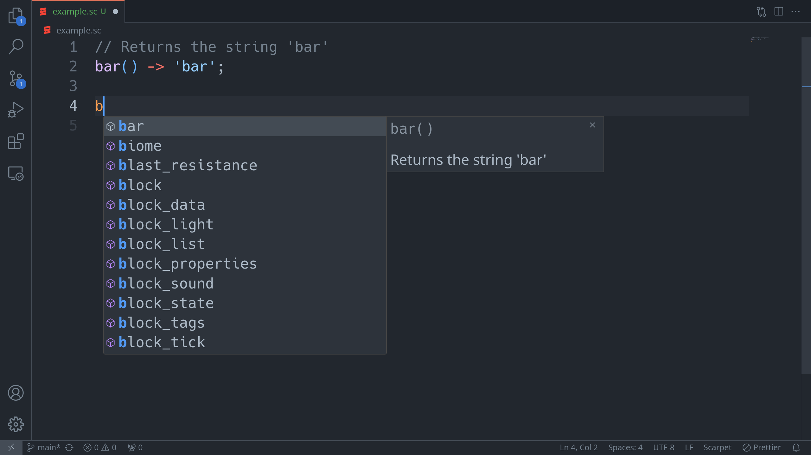

# Scarpet Language Support

Provides IDE-like features for Scarpet.

VSCode extension for the Scarpet LSP, see [FedericoCarboni/scarpet-ls] for
supported features.

Expect bugs!

## Screenshot

## Installation

This extension is published on [Open VSX][2].

On VSCodium it can be looked up and installed without leaving the editor.

On VSCode download and install the VSIX file directly or see [Using Open VSX in VSCode][1].

[FedericoCarboni/scarpet-ls]: https://github.com/FedericoCarboni/scarpet-ls
[1]: https://github.com/eclipse/openvsx/wiki/Using-Open-VSX-in-VS-Code
[2]: https://open-vsx.org/extension/federicocarboni/scarpet-ls
